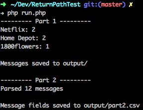
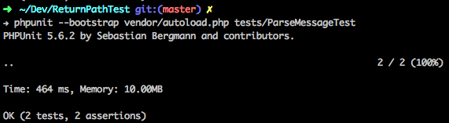

# Return Path Test

## Part 1:

Using the PHP [Google API client](https://developers.google.com/gmail/api/quickstart/php) installed with [composer](https://getcomposer.org/doc/00-intro.md#installation-linux-unix-osx) I was able to get messages that contain keywords in the subject lines.  Keywords are set in an array in [run.php on line 19](run.php#L19).

### Setup
I've included composer so you should be able to continue to Run the app

```sh
# install composer
wget https://getcomposer.org/installer -O composer-setup.php
php composer-setup.php
./composer.phar install

# install phpunit
# https://phpunit.de/getting-started.html
```

## Part 2:

Using the php function `gzfile` I was be able to read each message line by line to get the message date, sender and subject fields without manually extracting the messages.  These fields were then output pipe delimited to [files/output.csv](files/output.csv)

### Run the app
```sh
php run.php
```


### Run the tests
```sh
phpunit --bootstrap vendor/autoload.php tests/ParseMessageTest
```

